# Hybrid SaaS identity reference solution using Amazon Cognito
- [Introduction](#Introduction)
    - [Identity in a SaaS environment](#Identity-in-a-SaaS-environment)
    - [Exploring a Sample Environment](#Exploring-a-Sample-Environment)
    - [Hybrid SaaS Identity - conceptual model](#Hybrid-SaaS-Identity---conceptual-model)
    - [Hybrid SaaS Identity - reference solution](#Hybrid-SaaS-Identity---reference-solution)
- [Setting up the environment](#Setting-up-the-environment)
    - [Pre-requisites](#Pre-requisites)
    - [Bootstrapping](#Bootstrapping)
    - [Federation test infrastructure](#Federation-test-infrastructure)
    - [Monitor](#Monitor)
- [Onboarding tenants](#Onboarding-tenants)
    - [Setting up tenancy](#Setting-up-tenancy)
        - [Tenant provisioning workflow](#Tenant-provisioning-workflow)
        - [Monitor tenant provisioning](#Monitor-tenant-provisioning)
    - [Setting up federation to backend IDP](#Setting-up-federation-to-backend-IDP)
        - [Federation workflow](#Federation-workflow)
        - [Monitor tenant federation](#Monitor-federation)
- [Tenant context - maintaining conformity in hybrid IDP environments](#Tenant-context---maintaining-conformity-in-hybrid-IDP-environments)
    - [Cognito User - Tenant-1,2](#Cognito-User---Tenant-12)
    - [LDAP User - Tenant-3](#LDAP-User---Tenant-3)
- [Conclusion](#Conclusion)
- [Cleanup](#Cleanup)
    - [Delete tenant federation setting](#Delete-tenant-federation-setting)
    - [Delete tenant](#Delete-tenant)
    - [Delete HSI solution](#Delete-HSI-solution)

## Introduction
### Identity in a SaaS environment
In a typical software-as-a-service (SaaS) environment, your SaaS application would rely on an identity provider (IDP) to authenticate users access to the system within the context of a given tenant. This IDP accepts the authentication request, authenticates the user, and issues tokens that include the data about the user and its tenant context.

To support this experience, SaaS providers will often leverage one of the existing IDPs (Amazon Cognito, Okta, etc.) to implement their identity experience. This allows them to manage and control the entire footprint of their identity experience. The diagram below provides a high-level view of this model where tenant users are authenticated against an IDP managed by the SaaS provider.

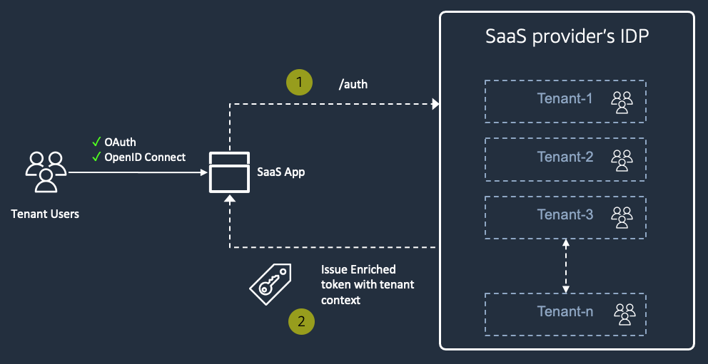

Figure 1: Typical SaaS Identity landscape

While this model maximizes control for the SaaS provider, there are instances where business or customer requirements may add some complexity to this approach. In some instances, customers may come to you that have existing IDPs. These customers may be unwilling to use your internally managed IDP for their solution. The example below provides a view of what this scenarios might look like.

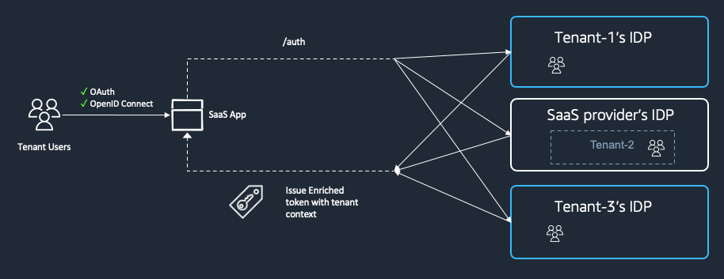

Figure 2: SaaS Identity in reality

In this diagram, you’ll see that we have three tenants that are using three different identity experiences. Tenant2 is using our internally managed IDP solution, while Tenant1 and Tenant 3 are using their own identity providers.

While this may seem like a classic identity federation model, it presents some specific challenges for our SaaS environment. How do you onboard tenants with these external identity providers? How do you generate tenant-aware tokens when using external identity providers that have no tenant context? How do we make all this work seamlessly without impacting the downstream implementation of our services that rely on these tokens?

This is the precise focus of the solution that we’ve created. Our goal here is to outline an approach that supports a mix of internal and external identity providers without undermining our need to have a frictionless onboarding and authentication experience.

### Exploring a Sample Environment

To better understand this problem, let’s look at a sample environment. If we go back to our prior example and fill in some more details, you can start to see how/where the support for multiple IDPs introduces some challenges in our environment.

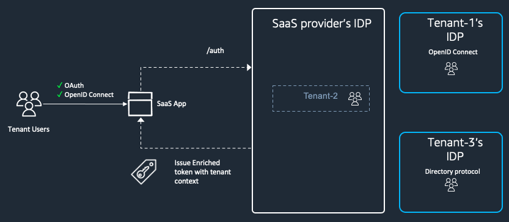

Figure 3: SaaS Identity in reality with IDP details

See tenant-1 in this picture, this is a tenant who has their users in their own IDP, which happens to be OpenID Connect compliant. Tenant-2 is ok with using SaaS providers IDP. Tenant-3, just like tenant-1 has its own IDP, which happens to be a simple directory server, LDAP compatible. This mix of SaaS providers own identity solution with a mix of externally hosted identity solutions introduce complexity into the identity layer which traverses throughout the SaaS architecture, let's look at the challenge more next.

Identity is a fundamental service in SaaS control plane that is used throughout the architecture at various levels to make granular decisions about permissions and provide least privileged access to underlying resources at run time. SaaS builders rely on Identity artifacts to enforce these policy decisions dynamically. Introducing disparate tenant specific identity systems could force the SaaS builders to develop their own custom logic to handle the tenant specific nuances in these identity artifacts. Sooner, rather later this could get out of hand from a management standpoint, but more importantly hard to trace bugs could be introduced. So, instead, we need a centralized mechanism that hides away these complexities from the SaaS builder. Let’s look at how a SaaS provider could tie these disparate identity systems together and still provide a cohesive experience to the SaaS developers using Hybrid SaaS Identity next.

### Hybrid SaaS Identity - conceptual model

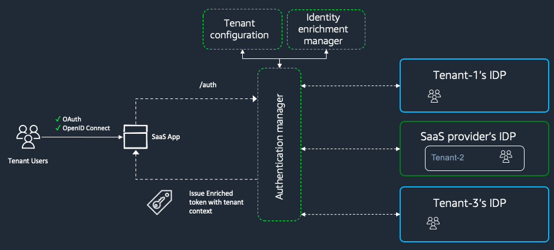

Figure 4: Hybrid SaaS Identity conceptual model

Hybrid Identity is a design pattern to solve the challenge we discussed above. Hybrid SaaS Identity (HSI), this repository is a reference solution that implements this pattern using Amazon Cognito. More on the technical details later, let’s look at the conceptual model first. Hybrid Identity comprises mainly of three components that work hand in glove, let's look at each one with their responsibilities:

Authentication manager: This is the core component, that has responsibilities to support the Identity uses cases of the SaaS providers IDP on one hand and on the other side it manages the connectivity to the tenant specific IDP backend. It acts as an adapter in that sense to translate and map the tenant specific IDP nuances back to the SaaS providers IDP needs. You can imagine this as the brains of the solution that makes it tick.

Identity enrichment manager: This component is all about adding the additional tenant context to the identity artifact the results from a AuthN/AuthZ operation. Naturally this component would rely on the Authentication manager to handle the tenant specific nuances. It will also rely on the tenant configuration component to glean necessary information about the tenant.

Tenant configuration: typically tenant micro-service is another core SaaS control plane service. Hybrid Identity needs it as a persistence and retrieval service to procure dynamically necessary tenant configuration to connect, translate and map back the tenant specific IDP constructs back into SaaS providers IDP.

Let's understand more about this conceptual model using a reference solution implementation in the remainder of this readme.
### Hybrid SaaS Identity - reference solution

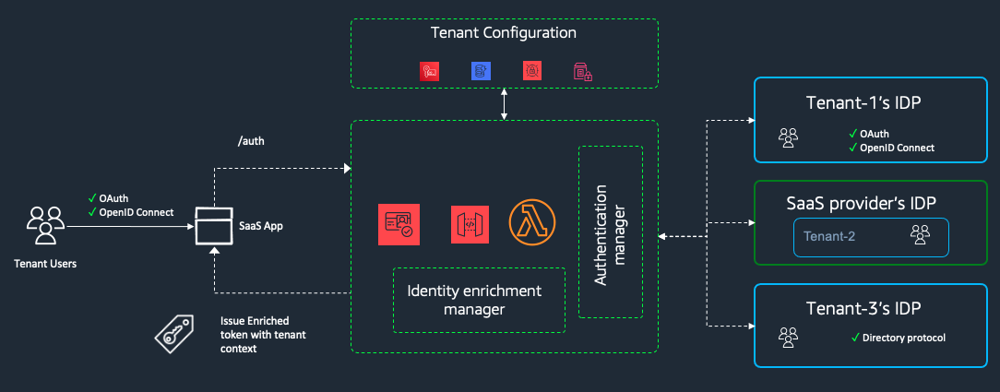

Figure 5: Hybrid SaaS Identity reference solution

SaaS builders often use OpenID Connect (OIDC) compliant identity provider (IDP) for their web applications and API's. SaaS Builders on AWS use Amazon Cognito for their AuthN/Z, which is an OpenID Connect compliant IDP. A core component of HSI is open source OIDC provider called [node-oidc-provider](https://github.com/panva/node-oidc-provider) extended to be multi-tenant by configuration. HSI is designed to be pluggable with out-of-the-box modules for connecting to LDAP and Amazon Cognito. HSI is architected on AWS serverless stack with the pooled multi-tenancy [pattern](https://d0.awsstatic.com/whitepapers/saas-solutions-on-aws-final.pdf) and because of that is can be easily used for silo style deployments as well.

The goal of this Hands-on SaaS style solution is to give you, the SaaS ISV builder, an experience at understanding the architecture of HSI by building the foundational constructs using a simple "Hello World" style SaaS App with a hypothetical scenario. We have used AWS CDK to build this solution and we will show snippets of code along the way to help illustrate the key design decisions made for multi-tenancy. Here is a quick visual on the steps that we will perform. 

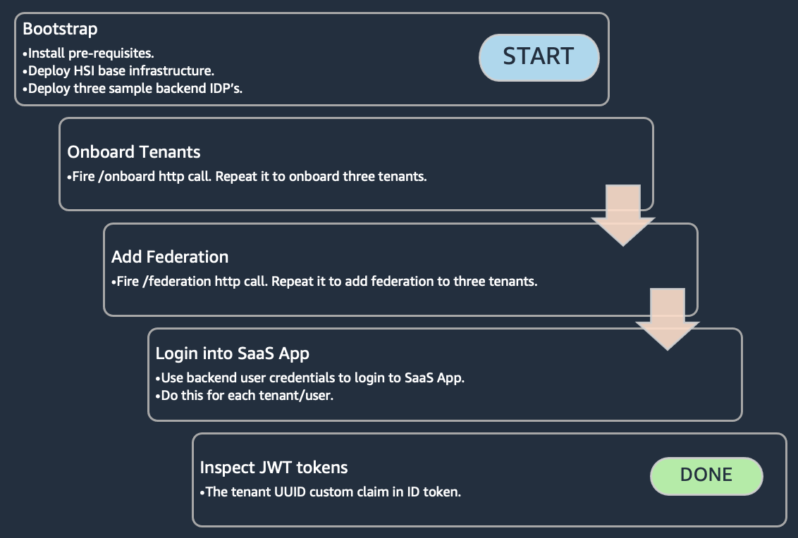

Figure 6: Hybrid SaaS Identity Handson steps

Refer to the [developer guide](./developer-guide.md) at any point for a deep dive on HSI. Without further ado, let's deploy HSI and test it by onboarding few tenants.


## Setting up the environment

> :warning: This solution requires an external domain name for which you control DNS settings using Amazon Route53 HostedZone. If you don't currently own a domain name, and would like to purchase one, follow [this](https://docs.aws.amazon.com/Route53/latest/DeveloperGuide/domain-register.html) guide to get one on Amazon Route53. If you have a domain that you currently control elsewhere, follow [this](https://docs.aws.amazon.com/Route53/latest/DeveloperGuide/dns-configuring.html) guide to use Amazon Route53 as your DNS service.

The base architecture of HSI includes a sample client, a sample resource that the client will access and authentication infrastructure that will in combination support tenant onboarding in the next step. Before we get to creating the base infrastrtuctre, we have few pre-requisites that we need to have in place. 

### Pre-requisites
Make sure you have the below in place to proceed further in consuming this solution.
1. Note down the hostedzone id by listing the hosted zones in your AWS account by following [this](https://docs.aws.amazon.com/Route53/latest/DeveloperGuide/ListInfoOnHostedZone.html) guide. we need this because we will use subdomain to lookup the tenancy of incoming request.
2. AWS CLI [configured](https://docs.aws.amazon.com/cli/latest/userguide/cli-chap-configure.html) and AWS CDK CLI [bootstrapped](https://docs.aws.amazon.com/cdk/api/latest/docs/pipelines-readme.html#cdk-environment-bootstrapping) on your local machine where you are going to run the next steps from. We need this because HSI is packaged as a CDK App for deployment. For e.g. to bootstrap cdk against a particular aws account, aws region, open up your terminal and issue this command after replacing 123456789012 with your AWS account ID and us-east-1 with your AWS region: 
    ```shell
    env CDK_NEW_BOOTSTRAP=1 npx cdk bootstrap \
    --cloudformation-execution-policies arn:aws:iam::aws:policy/AdministratorAccess \
    'aws://123456789012/us-east-1'
    ```
3. Install git-remote-codecommit, follow this [link](https://docs.aws.amazon.com/codecommit/latest/userguide/setting-up-git-remote-codecommit.html).
4. [Increase](https://docs.aws.amazon.com/servicequotas/latest/userguide/request-quota-increase.html) Service Quota for AWS Codebuild "Maximum number of concurrent running builds" to atleast 11. Use this deep [link](https://console.aws.amazon.com/servicequotas/home/services/codebuild/quotas/L-75822022).
5. Postman, curl or any other API client.

### Bootstrapping
Run the bootstrap script which creates the baseline infrastructure for HSI. You will have to supply a name for the codecommit repository (replace codecommitreponame, script will create the actual codecommit repo if it does not exist) and the hosted zone id from step#1 pre-reqs (replace hostedzoneid). Accept all security related change approvals prompted by the CDK console.

```bash
git clone https://github.com/aws-samples/aws-saas-factory-hybrid-saas-identity.git
cd aws-saas-factory-hybrid-saas-identity
chmod +x ./scripts/bootstrap.sh
./scripts/bootstrap.sh <codecommitreponame> <hostedzoneid>
```
### Federation test infrastructure
For you to try out HSI, we packaged three backend IDP's into a AWS CDK app, and a shell script that deploys the CDK app and creaates test users. This shell script will create one Simple AD service in a VPC, and two Cognito userpools to represent backend IDP for three test tenants that you could use further. This script can run in parallel to the bootstrap scropt above, Open a new terminal window, and run the following command from the root of your project to deploy the stack. You have to provide a email address in the below command, it will be used to create the Cognito userpool users.

```bash
chmod +x ./scripts/tenantstack.sh
./scripts/tenantstack.sh <YOUR_EMAIL_ADDRESS>
```
The response from the execution of this script will be printed to console as well as this [file](./hsi.out/tenantstack.out). In that output you will find three JSON payload(s) that you have to use for executing the federation api calls in the [section](#Setting-up-federation-to-backend-IDP) for three tenants. The output from this script will look like below:

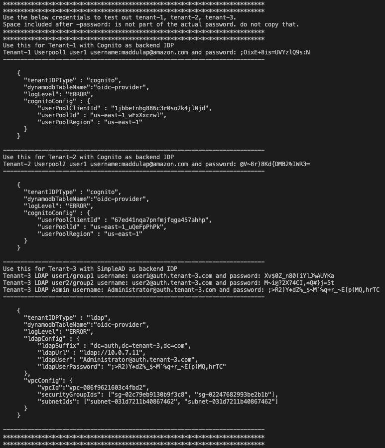

Figure 7: Sample tenant stack script output

###  Monitor
The way we have packaged HSI, most of the infrastructure is actually created as a result of the execution of the CodePipeline(s) that the bootstrap script creates. Hence, monitoring the CodePipeline execution to ensure successfull completion is important before you proceed further. 

Running the bootstrap script should have created a cloudformation stack called "HSI--Pipeline--Base". Monitor this stack for successful completion. It will also create a codepipeline called "Hybrid-SaaS-Identity_CI-CD_pipeline". Monitor that codepipeline for successful completion. This is a CDKPipeline, it will create more infrastructure as part of the codepipeline run, you should see more cloudformation stacks with name "Dev-AwsSaasFactoryHybridIdentityBaseStack*". Expect about 20 minutes for completion.

Running the test tenant script should have created three cloudformation stacks, TestStackApp, SimpleADStack, CognitoTestStack. CDK deploy command will wait for these stacks to finish, but feel free to monitor the cloudformation stacks as well. Expect about 10 minutes for completion.

Let all of these stacks run to completion, expect about 20 minutes overall for this step if the scripts were run in parallel using two terminal windows as suggested. Once done, what you will have is set of api's for onboarding tenants, and three tenant backend IDP's that which you will use in the next section. Proceed to the next section once setting up environment is successfully completed.

## Onboarding tenants
Tenant onboarding is a unqiue tailored experience to each SaaS application. To keep the focus on the Identity layer, we will split up the onboarding into a two step process, where the first step will focus on setting up the tenancy, and the second step will be all about setting up federation into the backend IDP. Let's get started with step-1, i.e. setting up tenant. Infact, we will setup three tenants here.

### Setting up tenancy
Open up your favorite http client. Create a PUT request to the tenant service api endpoint with the example JSON payload below. Replace the values with valid test inputs, especially the emailId, which will be used to setup a Cognito User. A validation email will be sent to this email address with a temporary password that you have to reset on first log in.

Http method: PUT

API Endpoint to use: onboarding api output from executing this command: (Commands also available in [this](./hsi.out/basestack.out) file.)
```shell
# onboarding api
echo "$(aws ssm get-parameter --name /mysaasapp/tenantApiEndPoint --query Parameter.Value --output text)onboard"
```
API body to use: replace emailId with a valid email ID
```json
{
    "tenantEmailDomain":"thinkr.dev",
    "tenantName":"tenant-one",
    "tenantSubDomain":"tenant-1",
    "emailId":"tenant-1-admin@amazon.com"
}
```
This PUT request will respond back with done if the tenancy provisioning workflow has kicked off successfully.
```json
{
    "done": true
}
```
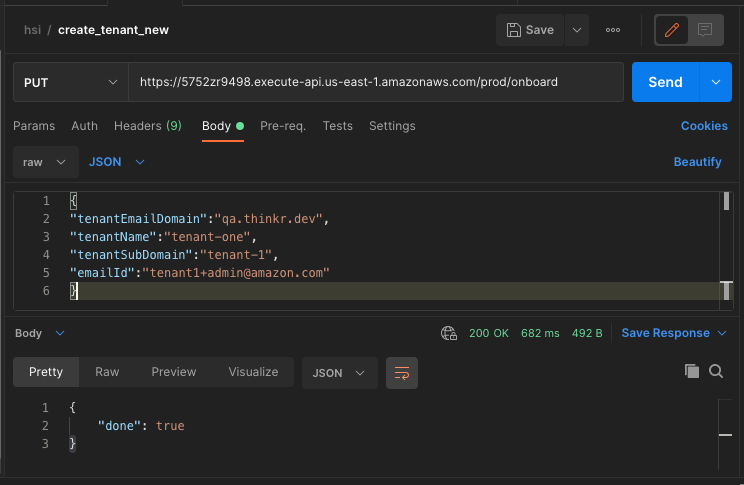

Figure 8: Federation http PUT API call using Postman

repeat this to onboard two more tenants, tenantSubDomain has to be unique, so should the emailId for each tenant. As an example the JSON payloads for the next two tenants would be:
```json
{
    "tenantEmailDomain":"thinkr.dev",
    "tenantName":"tenant-two",
    "tenantSubDomain":"tenant-2",
    "emailId":"tenant-2-admin@amazon.com"
}
```
```json
{
    "tenantEmailDomain":"thinkr.dev",
    "tenantName":"tenant-three",
    "tenantSubDomain":"tenant-3",
    "emailId":"tenant-3-admin@amazon.com"
}
```


#### Tenant provisioning workflow
Here is a quick glance of the steps involved in provisioning, refer to [this](./developer-guide#Tenant-Onboarding) section in the developer guide for more detailed information about each step.

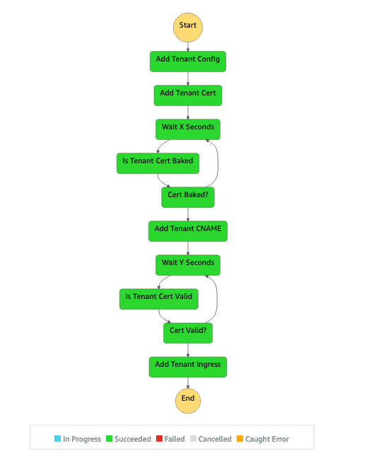

Figure 9: Tenant provisioning workflow - step function

#### Monitor tenant provisioning
To monitor the setup of tenancy, open up AWS Step functions [console](https://console.aws.amazon.com/states/home), observe the status of the step function that starts with "TenantInfraStateMachine". The Last step of the step function creates a A record in Route53 which will take some time to propagate. So, wait for few minutes and then open up the admin page for the tenant you just created using a private browser window by going to the below url format. (with the above example it would be https://tenant-1.thinkr.dev/admin)
```
https://[tenantSubDomain].[SaaSdomain].[TLD]/admin
```
You will be prompted to enter the username / password. use the email address that you supplied above for [emailId] and the temporary password Cognito sent in an email to that email address. Go through the flow to setup the final password, and you will eventually be taken to a page where you will see the ID token.

Here is example of the webpage response for /admin showing the access token, id token in raw and decoded format. Copy the id_token value to some place you can retrieve when needed to set up federation next.

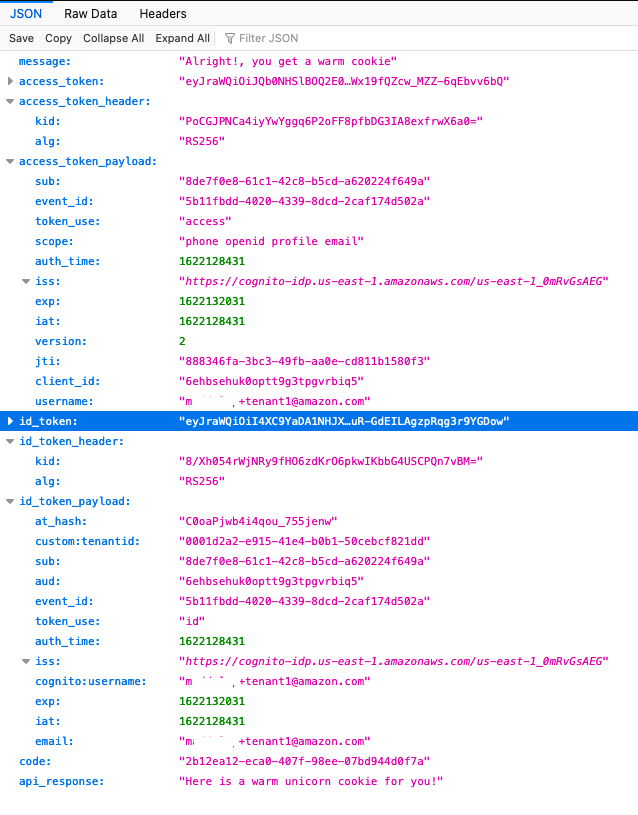

Figure 10: Sample ID token as a result of an admin user login

### Setting up federation to backend IDP
To setup federation, similar to what we did to setup tenancy, we will execute a http PUT call. You would need two things for the /federation api call. 1/ the ID token of an Admin user. 2/ the JSON payload that has the IDP details. Open up your http client, we will use postman here, start a PUT request, with Authorization type as Bearer Token, paste the ID token you saved from [this](#Monitor-tenant-provisioning) previous step. Go to Body and copy paste the first JSON payload from [this](./hsi.out/tenantstack.out) file. Execute the http api call and you should get a "done" message as response.

Http method: PUT

API Endpoint to use: onboarding api output from executing this command: (Commands also available in [this](./hsi.out/basestack.out) file.)
```shell
# onboarding api
echo "$(aws ssm get-parameter --name /mysaasapp/tenantApiEndPoint --query Parameter.Value --output text)federation"
```
API body to use: get this from 
```json
{
    "tenantIDPType" : "cognito",
    "dynamodbTableName":"oidc-provider",
    "logLevel": "ERROR",
    "cognitoConfig" : {
        "userPoolClientId" : "1qtsaja074feikah5qo1i3dqv9",
        "userPoolId" : "us-east-1_nkg3dWz6c",
        "userPoolRegion" : "us-east-1",
    }
}
```
This PUT request will respond back with done if the federation setup has kicked off successfully.
```json
{
    "done": true
}
```

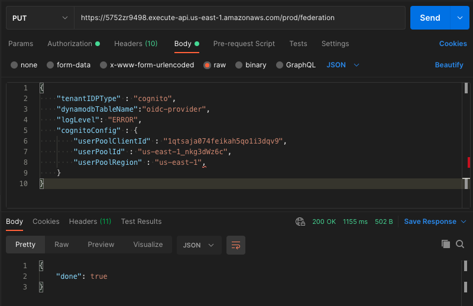

Figure 11: Federation http PUT API call using Postman

For example, I will open up a private browser window and go to admin page of my first tenant available at https://tenant-1.thinkr.dev/admin ,log in using the email, password that I received in a verification email from Cognito. Complete the initial password reset flow. I will copy the ID token value from the browser and keep it handy. This token is valid for an hour by default. Next I will execute the ssm get-parameter aws cli command to retrieve the tenant api endpoint for federation. I will copy the url and keep it handy. Next, I will open my postman client, create a new basic http request, change method to PUT, enter federation api url that I saved earlier, I will go to Authorization tab, choose the type as bearer token and enter the ID token that I saved earlier as value. I will then proceed to the Body tab, paste in the first JSON payload from the [tenantstack.out](./hsi.out/tenantstack.out) file. I will hit Send next, if everything is correct, I will get a response "done". I will [monitor](#Monitor-federation) the federation step function to ensure it is completed successfully before proceeding to add federation to the remaining two tenants. I will open a private browser window each time to avoid cognito session re-use and go to the individual tenant admin page to get the ID token. I will repeat the same steps for tenant-2, tenant-3 by obtaining the corresponding ID token from the /admin page, as well as the corresponding JSON payload from the tenantstack.out file.

Once you are done adding federation to all three tenants, what you have is a SaaS application with three tenants, each with it's own backend IDP with users setup. As part of setting up the tenants you have already added a admin user for each of the tenant, this user resides in the SaaS providers Cognito UserPool and has the tenant UUID added as an attribute to the user record within the UserPool. Now it is time to log into the SaaS app with the backend user credentials and see if we can still obtain the tenant UUID in the ID token. This is where the cohesive experience of this solution will come to fruition. Head out to the [next](#Tenant-context---maintaining-conformity-in-hybrid-IDP-environments) section.

#### Federation workflow
Here is a quick glance of the steps involved in adding federation, refer to [this](./developer-guide#Tenant-Federation) section in the developer guide for more detailed information about each step.

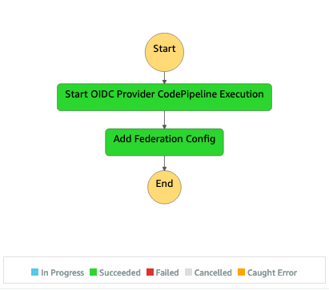

Figure 12: Tenant federation workflow - step function

#### Monitor federation
To monitor the setup of federation, open up AWS Step functions console using this [link](https://console.aws.amazon.com/states/home), observe the status of the step function that starts with "TenantFederationStateMachine".

## Tenant context - maintaining conformity in hybrid IDP environments
So far you have seen how to bootstrap HSI, onboard three tenants, setup federation for them. In that process you have already logged into the SaaS app as an admin user, you have seen the ID token, used it to setup federation as well. What you have also probably noticed in the /admin page response is the decoded ID token which has the custom:tenantid claim. The UUID value of this claim is the tenant UUID that HSI has assigned to that particular tenant while onboarding. This tenant UUID is a crucial piece of information that gives the consumer of this token, usually a backend micro-service,  a context to what they are about execute or process. This tenant context helps SaaS builders to build tenant specific isolation policies, scope down permissions and many other multi-tenant constructs. This is the core advantage of HSI where, it provides conformity in tenant context embedded in the id token regardless of the backend IDP type. HSI does this by maintaining a mapping between id token custom claims and AuthN/AuthZ attributes in both Cognito and OIDC Proxy tenant record. For more information on how this is implemented and how you can extend it to inject more information into the tenant context, check out the developer guide. Let's look at this in action in case of our three tenants that we have onboarded.
### Cognito User - Tenant-1,2
Open up the landing page for the first tenant, with Cognito as IDP backend, you created using a private browser session by going to the below url format. Login with your backend user credentials supplied by the test tenant stack output availble in [tenantstack.out](./hsi.out/tenantstack.out) file.
```
https://[tenantSubDomain].[yourdomain.TLD]/
```

For example I will go to https://tenant-1.thinkr.dev, use the email address and password from tenantstack.out file to log into the app, and would see ID token, Access token, presented on the screen, similar to what I saw before when I logged in as the admin for tenant-1.

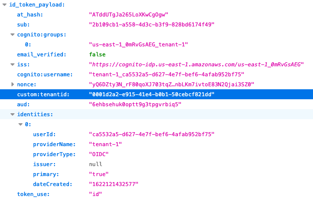

Figure 13: Sample ID token as a result of an tenant-1 backend user login (Cognito)

Notice the "custom:tenantid" claim in the "id_token_payload", the value of this key is the tenant UUID that was established as part of onboard API call.

Similarly, open up the landing page for tenant-2 in a private browser session, and login with the backend credentials to notice the tenantid custom claim with a different UUID.
### LDAP User - Tenant-3
Just like we did for tenant-1,2, the login experience will be similar for tenant-3 as well. Note that the email domain for the backend users will be auth.tenant-3.com, not the email address you have supplied.
```
https://[tenantSubDomain].[yourdomain.TLD]/
```
In my case, I will go to https://tenant-3.thinkr.dev and login with user1@auth.tenant-3.com and the corresponding password from tenantstack.out file to obtain the ID token that looks like shown below.

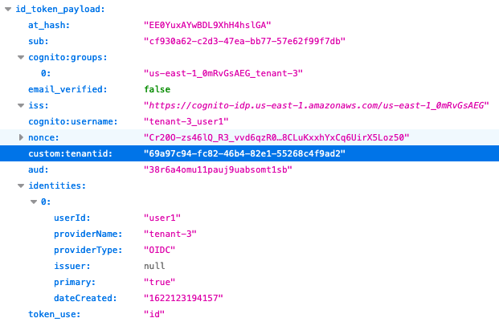

Figure 14: Sample ID token as a result of an tenant-3 backend user login (LDAP)

Notice the same "custom:tenantid" claim in the "id_token_payload" and the same issuer "iss". Backend API resources who typically introspect the id token to extract tenant context can reliably use this custom claim to interpret the tenant of the request they are about to process. With this you have successfully deployed and tested HSI solution, before you close out, head to the [next](#Conclusion) section.
## Conclusion
In this Hybrid SaaS Identity hands-on SaaS solution, you have created base infrastructure, onboarded three tenants, added federation to backend IDP's. By visitng the root page of the tenant subdomain as well as the /admin page for, you observed that you could log in with either admin user or the backend IDP user belonging to Cognito or Simple Directory service and still get an ID token issued by Cognito with tenant context (tenant UUID as a custom claim). This is the conformity in experience that HSI is built for. Read the [developer guide](./developer-guide.md) for a detailed walkthrough of how HSI is built, functions and aspects like scaling. 
> :information_source: The resources you have created in this handson saas solution might be outside of the free tier limits, so please visit the next section to [cleanup](#Cleanup).

## Cleanup
While trying out this solution, there could be situations where you want to start over, so here are the most common scenarios and how you reset them.

### Delete tenant federation setting
To undo a specific tenants federation, run through the following steps.

1. Delete Identity provider in federation Cognito UserPool.
2. Delete tenant, client record from oidc-provider ddb table. Note the tenant UUID.
3. Delete secrets from secrets mgr.
    `/mysaasapp/${tenantSubDomain}/jwks`
    `/mysaasapp/${tenantSubDomain}/cookie-secrets`
    `/mysaasapp/${tenantSubDomain}/oidcappclientsecret`
4. Delete ssm parameters from systems mgr.
    `/mysaasapp/${tenantSubDomain}/tenantOidcProviderAppClientUuid`
5. Update tenant record from tenants ddb table. Search for it using tenant sub domain. Set idp_identifier to Cognito.
6. Delete the tenant specific oidc provider by deleting the stack from cloudformation. Stack will be suffixed with the tenant UUID.

### Delete tenant
To remove a tenant altogether, run through these steps.
1. Delete Admin user from the federation Cognito Userpool.
2. Delete Identity provider, App Client from federation Cognito UserPool.
3. Delete tenant, client record from oidc-provider ddb table.
4. Delete secrets from secrets manager.
    `/mysaasapp/${tenantSubDomain}/jwks`
    `/mysaasapp/${tenantSubDomain}/cookie-secrets`
    `/mysaasapp/${tenantSubDomain}/oidcappclientsecret`
    `/mysaasapp/${tenantSubDomain}/federationclientsecret`
5. Delete ssm parameters from systems manager.
    `/mysaasapp/${tenantSubDomain}/tenantOidcProviderAppClientUuid`
    `/mysaasapp/${tenantSubDomain}/tenantUuid`
    `/mysaasapp/${tenantSubDomain}/tenantEmailDomain`
    `/mysaasapp/${tenantSubDomain}/federationCognitoUserPoolAppClientId`
6. Delete tenant record from tenants ddb table. Search for it using tenant sub domain.
7. Delete A-record from Route53 hosted zone for the tenant subdomain.
8. Delete APIGW custom domain name `${tenantSubDomain}.${SaaSDomain}.${TLD}`
9. Delete ACM certificate for the tenant subdomain. Check if the cert is flagged as in use by cloudfront still, attempt deletion after some time.

### Delete HSI solution
Most of the infrastructure created in this solution is done using Codepipeline and step functions. So, destroying just the CDK stacks deployed will not delete everything. Run the below script that deletes all the custom domain mappings, secrets, parameters, certs and cloudformation stacks created by the HSI CodePipeline and Onboarding orchestrator before it proceeds to delete the base, oidc-provider CDK stacks. The prefix used by ssm parameters and secrets is "/mysaasapp" and this cleanup script greedily deletes all resources from secrets manager, parameter store with that prefix. 
> :information_source: This cleanup script will not delete the pre-requisite hostedzone, codecommit repo, please delete them manually via console or CLI.

```shell
chmod +x ./scripts/cleanup.sh
./scripts/cleanup.sh <hostedzoneid>
```
