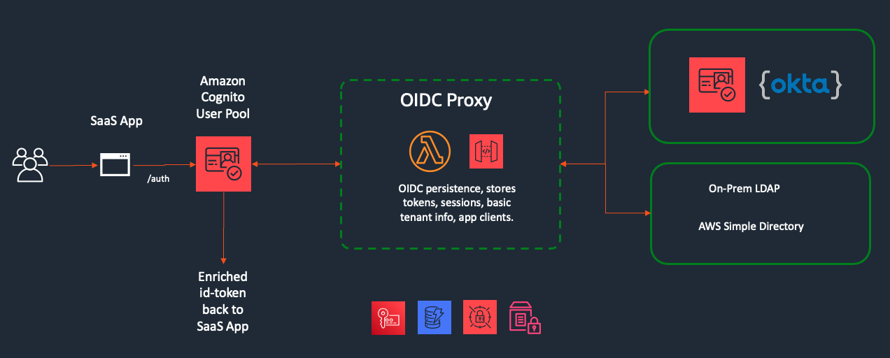
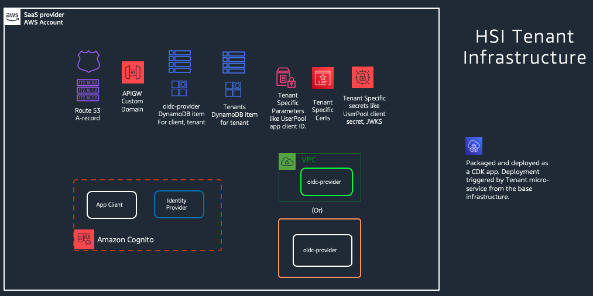
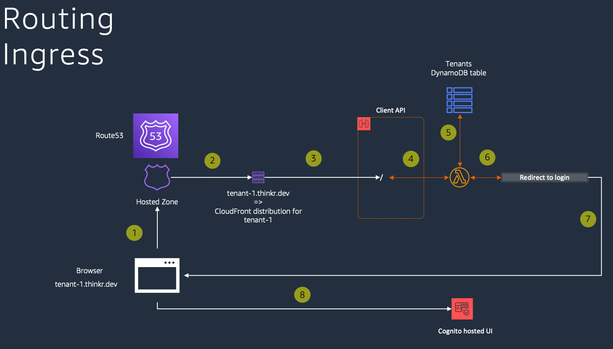
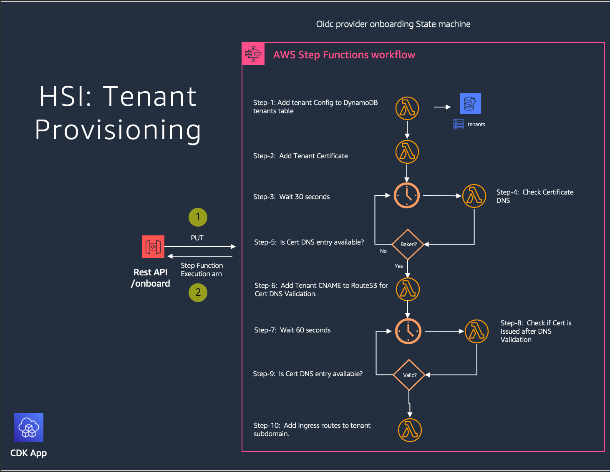
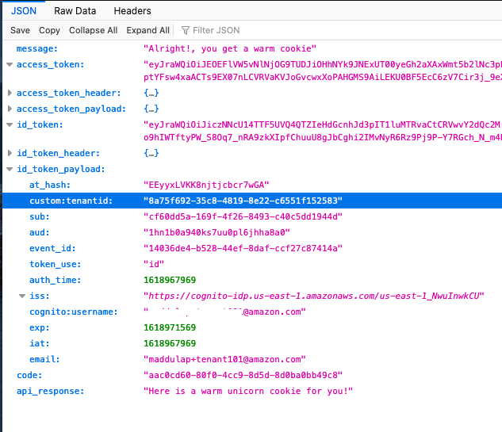
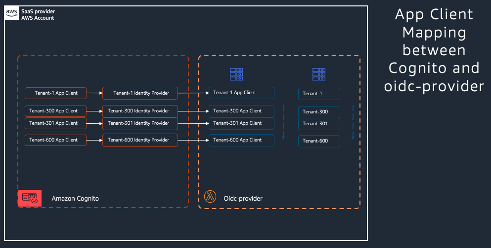
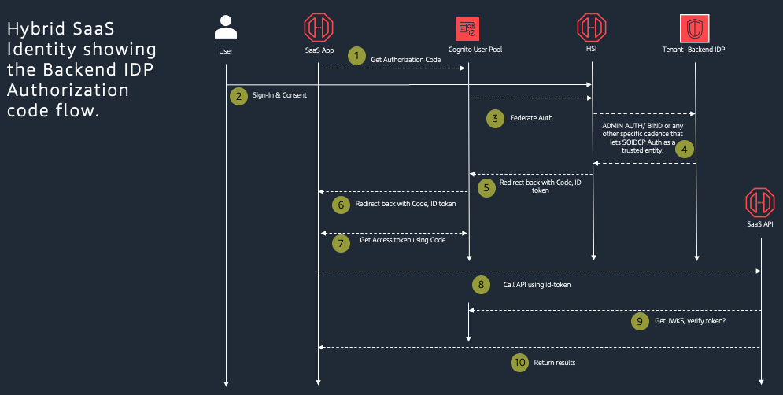
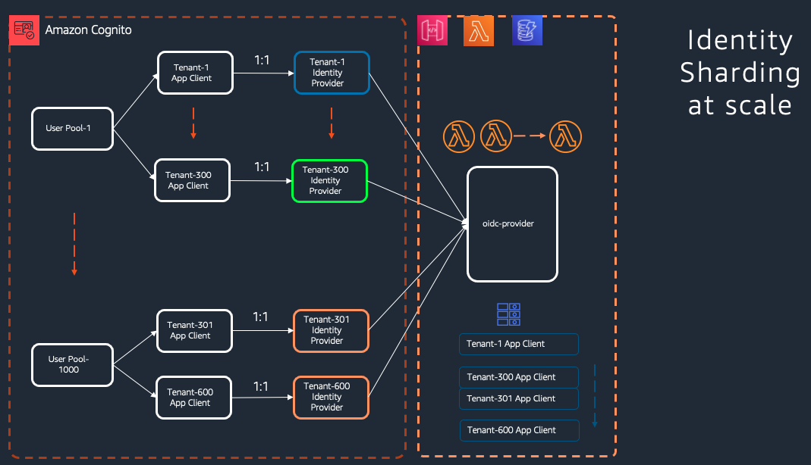

# Hybrid SaaS Identity developer guide

[Introduction](#introduction)

[Legacy Identity Challenge](#legacy-identity-challenge)

[High-Level Architecture](#high-level-architecture)

[The Baseline Infrastructure](#the-baseline-infrastructure)

[Per-tenant Infrastructure](#per-tenant-infrastructure)

[Tenant Routing](#tenant-routing)

[Tenant Onboarding](#tenant-onboarding)

[Tenant Federation](#tenant-federation)

[AuthN/AuthZ](#authnauthz)

[Scaling](#scaling)

[Conclusion](#conclusion)

## Introduction

Hybrid SaaS Identity [HSI] is a reference Identity proxy solution for
solving the disparate identity integration [challenge](./README.md#Challenge-with-disparate-backend-IDP's) faced by multi-tenant SaaS
application builders. HSI uses Amazon Cognito as it’s IDP with an
open-source OpenID certified implementation [node oidc
provider](https://github.com/panva/node-oidc-provider) acting as a
federation receiver. Oidc-provider sits between Cognito and the legacy
backend. It acts as an adapter wrapping the legacy backend IDP in an
OpenID Connect layer. The goal of this developer guide is to act as a
reference to HSI showing all the components involved, configurations
necessary to onboard a tenant, add federation and map custom claims.
Let’s start with a high-level architecture walkthrough.

## High-Level Architecture

We built HSI as a serverless application using mainly Amazon Cognito,
Amazon ApiGateway, AWS Lambda, Amazon DynamoDB as key services among
several other. For deployment it is packaged as a CDK construct, as well
as CDK App. From a SaaS architectural style perspective, it is built as
pooled multi-tenant, so you can use a single HSI deployment to support
multiple tenants. Since it is packaged as a CDK app it is fairly
straightforward to deploy a silo instance of HSI for a single tenant. We
will look at all the infrastructure components in depth in the new few
sections when we visit the baseline and tenant specific modules. HSI at
this point is written in Nodejs and CDK portion of the solution is
written in Typescript. Here is a diagram depicting HSI architecture at a
high level.



Figure. 2: Hybrid SaaS Identity Architecture.

As you can see OIDC Proxy is the central component within the solution,
and as mentioned at the beginning, this proxy layer is built using Node
OIDC Provider. We leverage Cognito UserPool Identity provider to
federate the AuthN to OIDC Proxy. OIDC Proxy than executes the AuthN
request with the backend IDP that is preconfigured for that incoming
requests tenant context. OIDC Proxy has built in modules that currently
support Cognito, LDAP type backend IDP’s. OIDC Proxy hosts a sign in
page built using Koa framework. Persistence is provided using DynamoDB,
Parameter store and Secrets manager.

Remaining components in this architecture support the reference solution
to showcase the capabilities of HSI. In most cases they are just mock
functionality, for example, the SaaS App is just a hello world style
application that just prints the JWT tokens to the browser window. We
will look at these further in the next two sections where we look at the
baseline and tenant infrastructure in detail.

## The Baseline Infrastructure

When you consume HSI and deploy it for the first time, you will create
the bare minimum serverless stack that represents the baseline
infrastructure, we call it baseline because this is without any tenants
onboarded and is in fact needed to onboard tenants. Here is a list of Cloudformation stacks that form the baseline stack.

|Name|Resources|Description|
|----|---------|-----------|
|HSI--Pipeline--Base|CDKPipeline, CodeBuild, SSM Parameters|Self Mutating CDK Pipeline that deploys the remaining Base Stacks.|
|HSI--Pipeline--OidcProvider|CodePipeline, CodeBuild, Lambda Function|CodePipeline that creates the oidc-provider Function, API.|
|Dev-AwsSaaSFactoryHybridIdentityBaseStackBaseStack|Cognito Userpool, DynamoDB tables, Step Function, SSM Parameters, Secrets Manager|Creates the Cognito userpool that hosts the federation Identity provider, client, configuration, Also creates the step function that adds to base features configuration to the DynamoDB table used by oidc-provider.|
|Dev-AwsSaaSFactoryHybridIdentityBaseStacktenantservice*|Tenant API, Lambda Functions, Step Functions|Tenant microservice with onboard, federation features.|
|Dev-AwsSaaSFactoryHybridIdentityBaseStackoidcresource*|Resource API, Lambda Function|Sample resource API that just echoes back the decoded JWT tokens.|
|Dev-AwsSaasFactoryHybridIdentityBaseStackoidcclient*|Client API, Lambda Function, SSM Parameters|Sample client that redirects straight to login page after looking up tenant using the Authorizer context.|

Here is
quick list of all components that comprise the baseline infrastructure
with a brief description of each.

| HSI Code repository                        | Code Commit repository                                                                              | Hosts the HSI code in your AWS Account. Necessary as the source stage of the self-mutating base stack pipeline.                                                                                                                                                                                                                                               |
| ------------------------------------------ | --------------------------------------------------------------------------------------------------- | ------------------------------------------------------------------------------------------------------------------------------------------------------------------------------------------------------------------------------------------------------------------------------------------------------------------------------------------------------------- |
| HSI Base CI/CD pipeline                    | CodePipeline, CDK Pipeline                                                                          | Self-Mutating Code pipeline that actually deploys the rest of the base stack.                                                                                                                                                                                                                                                                                 |
| Oidc-provider table                        | DynamoDB Table, GSI                                                                                 | Persistence layer for oidc-provider [OIDC proxy]. Single storage that could be shared between all instances of the OIDC proxy.                                                                                                                                                                                                                              |
| SaaS provider Cognito UserPool             | Cognito UserPool                                                                                    | SaaS Identity provider that could “host” a bunch of tenants.                                                                                                                                                                                                                                                                                                  |
| Tenants table                              | DynamoDB Table, GSI                                                                                 | Persistence layer for tenant micro-service that stores the definition, configuration associated with each tenant. Includes information like tenant UUID, UserPool ID, UserPool App Client ID. Look at an example here.                                                                                                                                        |
| Oidc-Provider features state machine       | Step Function, AWS Lambda                                                                           | Adds the base set of features that suit the SaaS provider, these features tune the way oidc-provider behaves at run time. Look at the default we use here. Read more about these in the upstream node-oidc project [here](https://github.com/panva/node-oidc-provider/blob/main/docs/README.md#features).                                                     |
| Oidc resource [SaaS backend API]         | CDK Construct, Amazon API Gateway, Lambda Authorizer, AWS Lambda                                    | Packaged as a CDK Construct, this simple API just checks the validity of the JWT token in the incoming request and responds with a warm cookie message and decoded JWT contents.                                                                                                                                                                              |
| Oidc client [SaaS App/ Front end client] | CDK Construct, Amazon APIGateway, Lambda Authorizer, AWS Lambda                                     | This is a purposefully minimal front end app built to retain the focus on the identity aspects of the solution. It uses a combination of Amazon API Gateway VTL to redirect / or /admin to the corresponding Cognito UserPool after looking up these details based on the subdomain. The lookup response is cached at the authorizer for performance reasons. |
| Tenant micro-service                       | CDK Construct, Amazon APIGateway, AWS Step Functions, Lambda Authorizer, AWS Lambda, DynamoDB Table | Tenant micro-service that has /onboard and /federate functionality. Both these operations are orchestrated by Step Functions and implemented by Lambda functions. We will go through these in depth in the tenant onboarding section of this guide.                                                                                                           |
| Base Parameters                            | AWS Systems Manager Parameter store.                                                                | Various baseline infrastructure stack parameters used here and to support tenant specific components are stored in parameter store for easy retrieval/lookup in CDK / CloudFormation.                                                                                                                                                                         |

As you can see in the diagram below, the general principle we followed
for categorizing some component of the architecture to be included in
baseline was to see if it is necessary regardless of a tenant or to
support onboarding one later.


Figure. 3: Hybrid SaaS Identity baseline infrastructure

## Per-tenant Infrastructure

Once the baselines infrastructure is in place, it is time to onboard a
tenant on to HSI. As part of provisioning, you would essentially create
a combination of configuration data in parameter store, DynamoDB,
secrets manager in addition to core AWS service components. These two
types of tenant specific infrastructure elements are usually spread
across two categories of activities within HSI namely ingress and
federation. This reference solution has included them as resources in a
tenant micro-service that you can invoke over http. More about
onboarding later in the next section. Here is an exhaustive list of all
components that are created per each tenant.

|Tenant Item|DynamoDB item|Tenant config stored as item in tenants table.|
|--- |--- |--- |
|Tenant Certificate|ACM Cert|ACM Certificate for tenant subdomain|
|Tenant Subdomain mapping|APIGW subdomain mapping|Mapping tenant subdomain to oidc-client api base path using the tenant certificate.|
|Tenant Subdomain DNS entry|Route53 A record|Tenant Subdomain mapped to the APIGW CloudFront distribution ID.|
|Oidc-provider proxy|CDK oidc-provider construct|Two situations when you would need to create a new instance of oidc-provider: If the tenant backend IDP needs VPC connectivity then oidc-provider needs to be deployed to that VPC or a peered VPC. If the tenant needs to be sharded to a new oidc-provider to limit blast radius.|
|Tenant Secrets|Secrets Manager|Each tenant will have it’s own JWKS, Cookie signing key and client secret.|
|UserPool Identity provider|Cognito UserPool Identity provider|Each tenant will have an Identity Provider created in Cognito.|
|UserPool App Client|Cognit UserPool App Client|Each tenant will have a App Client enabled to use the tenant specific Identity Provider only.|
|Tenant oidc-provider config|DynamoDB item|Each tenant will be defined in oidc-provider using a json configuration record that will define attributes like custom claim mappings, backend IDP details, JWT issuer among other key aspects. More about this in the authentication section.|
|Tenant Client oidc-provider config|DynamoDB item|Each tenant will get a client created in oidc-provider with a corresponding client secret. More about this in the authentication section.|



Figure. 4: Hybrid SaaS Identity Tenant specific infrastructure

## Tenant Routing

The north-south traffic flow of tenant specific traffic is handled at
two different levels in this reference solution. There is flexibility
however, in the manner which this can be configured with just few
requirements from an oidc-provider perspective. We will start with what
is offered out of the box in this reference solution and call out the
unique requirements as we move along. Let’s start with ingress, the
front gate of our SaaS client. In ingress we adopted sub-domain-based
routing, which, simply put, takes the subdomain part of the host header,
looks up the tenant information associated with that subdomain and
determines the UserPool ID, UserPool App Client ID to use for the
authorize api call with Cognito. There is additional information that is
retrieved as well such as claims, identity provider etc.



Here is a brief step by step:

1.  Browser seeks tenant-1.thinkr.dev

2.  Route53 DNS service responds with the Cloudfront distribution for
    APIGW.

3.  APIGW Custom domain mapping points this incoming request to the
    oidc-client base path.

4.  Oidc-client [SaaS App] invokes the Lambda Authorizer

5.  Lambda Authorizer looks up tenant information based on subdomain and
    retrieves the authentication information necessary [As shown
    below] and adds it to context.

6.  Api Gateway uses the context information added by the authorizer and
    issues a http 302 with the URL stitched as shown below.

Below table lists all those details and explains each one in detail.

| $context.authorizer.auth_endpoint  | Auth Endpoint  | Authorize endpoint of Cognito UserPool |
| ----------------------------------- | -------------- | -------------------------------------- |
| $context.authorizer.clientid        | App Client ID  | Cognito UserPool App Client ID         |
| $context.authorizer.response_type  | Response type  | OAuth response type                    |
| $context.authorizer.scope           | Scope          | OAuth Scopes                           |
| $context.authorizer.idp_identifier | IDP Identifier | Cognito UserPool Identifier            |

http 302 redirect URL format:

$context.authorizer.auth_endpoint+"?client_id="+$context.authorizer.clientid+"\&response_type="+$context.authorizer.response_type+"\&scope="+$context.authorizer.scope+"\&identity_provider="+$context.authorizer.idp_identifier+"\&redirect_uri="+"https://"+$context.domainName+"/callback"

## Tenant Onboarding

HSI follows a pooled architecture model for the SaaS client and resource
API. Onboarding a tenant is handled by a step function orchestrator that
sets up the A-record in Route53 hosted zone, ACM certificate, adds
Cognito app client and a tenant configuration item to DynamoDB. This
onboarding step function is fronted by API Gateway resource /onboard
that accepts http PUT request with the following payload, with
parameters as explained in the table.

```json
{
    "tenantEmailDomain":"thinkr.dev",
    "tenantName":"tenant-one",
    "tenantSubDomain":"tenant-1",
    "emailId":"admin+tenant1@amazon.com"
}
```

| tenantEmailDomain | Domain name of the email                  |
| ----------------- | ----------------------------------------- |
| tenantName        | Name of the tenant                        |
| tenantSubDomain   | Subdomain assigned to the tenant          |
| emailId           | Email address of the tenant administrator |

In HSI onboarding is an unauthenticated request following a typical
signup page on a SaaS home page. Once the http call is fired, api
gateway immediately responds back with an acknowledgement.
Asynchronously the step function executes the steps depicted in the
following diagram.



All of the 10 steps outlined are run using the same lambda function
under “resources/add_tenant_infra_lambda”. Each time step function
invokes the function synchronously using a handle representative of the
step it is trying to execute. Step functions can handle multiple
concurrent executions, so this would give you an implicit queuing
mechanism for tenant onboarding. For more control have the onboard api
add a message to a queue and pull the messages from the queue using a
lambda worker at a defined rate.

An admin user is created in the Cognito UserPool with the supplied email
address as the username. Admin user will get a verification email with
temporary password that can be used to log on to . Once the admin user
goes through the password setting process and logs in successfully, they
will see a JSON response printed to the browser as shown below. We are
doing this to highlight the JWT tokens vended by Cognito and show the
custom claim tenantuuid that we have injected using oidc-provider. Here
is a quick screenshot of how the response looks like in firefox browser.



## Tenant Federation

An authenticated admin can add federation backend IDP details to the
tenant they belong to. To do that they take the id_token from the
output of the /admin page and use it as the authorization header to fire
the /federation api call with this payload for adding a LDAP type of
IDP.
```json
{
    "tenantIDPType" : "ldap",
    "dynamodbTableName":"oidc-provider",
    "logLevel": "ERROR",
    "ldapConfig" : {
        "ldapSuffix" : "dc=auth,dc=tenant-3,dc=com",
        "ldapUrl" : "ldap://<SIMPLE_AD_DNS>"
    },
    "vpcConfig": {
        "vpcId":"vpc-0b51f09045aa361d7",
        "securityGroupIds": ["sg-0fe5172df5d73d0c4", "sg-08251e9f1a4618263"],
        "subnetIds": ["subnet-08cb3f2277a9f06d5", "subnet-05e133a384c681e6c"]
    }
}
```
To add a Cognito type backend IDP, payload would be
```json
{

    "tenantIDPType" : "cognito",
    "dynamodbTableName":"oidc-provider",
    "logLevel": "ERROR",
    "cognitoConfig" : {
        "userPoolClientId" : "1qtsaja074feikah5qo1i3dqv9",
        "userPoolId" : "us-east-1_nkg3dWz6c",
        "userPoolRegion" : "us-east-1"
    }
}
```

Similar to onboard api call, federation too, kicks off a step function
execution as shown in the below diagram. The first step of the
federation workflow checks if a oidc-provider needs to be deployed with
a vpc attachment, if not it checks if a non-vpc oidc-provider is
available to reuse it for the current tenant. Oidc-provider creation is
handled by a CodePipeline, step function uses a task token wait pattern
for the first step. Completion of the first step is signaled back to
step function either by the
“resources/start_oidc_provider_pipeline_lambda” or by the
“resources/finish_oidc_provider_pipeline_lambda” lambda function
depending on whether the oidc-provider CodePipeline was run.


The second step of the federation workflow adds the remaining pieces of
configuration and AWS services necessary to support the federation as
listed in the below table

| Secrets                            | Adds JWKS, client Secret, cookie signing key                                                                                          |
| ---------------------------------- | ------------------------------------------------------------------------------------------------------------------------------------- |
| Tenant record – oidc-provider      | Adds tenant item to oidc-provider table with backend IDP details supplied in the payload.                                             |
| Tenant record – tenants            | Updates the item in tenants table to indicate the switch of idp_identifier from Cognito to the new customer owned identity provider. |
| App Client record – oidc-provider  | Adds client item to oidc-provider table.                                                                                              |
| Cognito UserPool Identity Provider | Creates identity provider with details pointing to the oidc-provider.                                                                 |
| Cognito UserPool App Client        | Updates App Client allowed identity providers list to include the identity provider create above.                                     |

With this a tenant should be setup with federation to their supplied
backend IDP. A regular non-admin user can go to the tenant subdomain
page to test out the federation experience.

https://tenant-subdomain.saasdomain.tld

Opening up that url in a browser should redirect the user to the login
page hosted on oidc-provider instead of Cognito. Once they type in valid
credentials and sign in, the response they see on the page should be
similar to what the admin user sees on the admin page. The custom claim
“custom:tenantid” should still be populated, the key difference being
where the custom claim was generated which in case of federation would
be oidc-provider. To know more about what happened behind the scenes to
make this end-to-end authentication flow with federation possible head
to the next section where we look at authentication flow in depth.

## AuthN/AuthZ

If we zoom in on just the identity aspects of the solution, a pattern
emerges here and it is worth spending some time understanding this in
detail because we leverage it not only to support different flavors of
multi-tenant architecture styles but also scale. A key design aspect of
Oidc-provider is that it is registered as an oidc identity provider in
Cognito. In pooled oidc-provider deployment you have a single Ax\`pi
Gateway endpoint for more than one tenant. From an isolation standpoint
it is important to have tenant specific JWT signing keys even in a
pooled architecture. OIDC spec has a mechanism for consumers of the JWT
tokens to lookup these keys using well-known/openid-configuration
endpoint on the provider. When Cognito performs the initial
openid-configuration lookup upon registering oidc-provider as an
identity provider, we have to make sure the openid endpoint somehow
serves tenant specific metadata, to solve this puzzle we appended
oidc-provider ClientID which is the most granular identifier associated
with a tenant. Now oidc-provider knows the context of the incoming
request from Cognito and serves up the tenant specific keys from JWKS it
stores in secrets manager. The choice of using client ID gives
flexibility to extend this architecture to use-cases where a tenant may
have access to more than one SaaS app offered by the ISV. Cognito
requires that in federation use-cases UserPool app client has to be
mapped to an identity provider 1:1 and we did just that as shown in the
below diagram.



A typical Authorization code flow, which is what we use in the SaaS app
in our solution, looks like the below diagram. Key point to note here is
that there are two additional hops in this flow compared to a typical
flow, 1\\ where Cognito federates into oidc-provider (Step-3) and 2\\
where oidc-provider reaches out to the backend IDP to get the AuthN
performed.



## Scaling

HSI uses a combination of AWS Services with decoupling achieved through
micro-services. All of the AWS services used in this solution are
serverless, so HSI inherits the benefit of scale out that serverless
brings forth. Taking a step further HSI can scale in a heterogenous
scale out fashion at individual service level. Let’s take a look at what
that means with few examples. Amazon Cognito can scale out in a
multi-tenant environment by sharding tenants to a new UserPool once the
current shard reached a set threshold. It is also possible to come up
with a different sharding strategy to distribute tenants to a set of
UserPools depending on a pre-established criterion like tenant type,
tier etc. Oidc-Provider is deployed onto Api Gateway, Lambda and
DynamoDB. Scaling with oidc-provider is similar to other serverless
API’s, where you can leverage Lambda features like provisioned
concurrency, reserved concurrency. Read more about function scaling
[here](https://docs.aws.amazon.com/lambda/latest/dg/invocation-scaling.html).
DynamoDB is the persistence layer for oidc-provider, designing it for
multi-tenancy is discussed at length in
[this](https://aws.amazon.com/blogs/apn/multi-tenant-storage-with-amazon-dynamodb/)
blog post.



## Conclusion

You have now a good deep dive view of what HSI was built to solve, what
went into building HSI and how various modules are stitched together.
Identity is a complex topic, with SaaS adding a whole extra dimension. A
key tenet of HSI reference solution was to encapsulate this complexity
in consumable, easily deployable package. This developer guide is an
attempt to unpack that complexity layer by layer to show enough detail
to help solidify some of the key design patterns we adopted along the
way. This entire code base is open-sourced, we welcome any contributions
for bug fixes, improvements and additional features including
corrections, additions to this developer guide.
